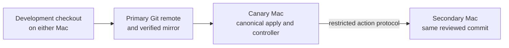

# Workstation showcase

This repository is a curated public view of my two-Mac development environment.
It shows the architecture, operating principles, update workflow, machine
lifecycle design, and representative Neovim, WezTerm, and tmux configuration.

The production repository is intentionally private. This snapshot has an
independent Git history and contains no machine inventory, credentials, trust
material, internal endpoints, backup configuration, mail or calendar setup, or
machine-local state.

## Design goals

- Keep both Macs useful for the same development and study work.
- Treat Git as the source of truth for shared configuration.
- Apply one reviewed commit to the canary before the secondary.
- Make everyday changes take minutes rather than a full release ceremony.
- Use targeted verification for sensitive subsystems.
- Make factory reset and hardware replacement resumable and auditable.
- Keep synchronization, backup, and secret management as separate concerns.

## Architecture

The restricted channel is not an interactive shell. It accepts only reviewed
actions such as status, standard synchronization, guarded synchronization, and
bounded release phases.

## Repository contents

- [`docs/architecture.md`](docs/architecture.md) — component and trust model.
- [`docs/workflows.md`](docs/workflows.md) — fast, standard, guarded, and strict workflows.
- [`docs/machine-lifecycle.md`](docs/machine-lifecycle.md) — reset and replacement model.
- [`config/nvim`](config/nvim) — representative Neovim configuration.
- [`config/wezterm`](config/wezterm) — terminal appearance and behavior.
- [`config/tmux`](config/tmux) — terminal session workflow.
- [`scripts/verify-showcase.sh`](scripts/verify-showcase.sh) — exact-tree and safety check.

## Important boundary

This is a portfolio and learning artifact, not a one-command installer. The
examples are useful starting points, but production automation and personal
service configuration are deliberately absent.
