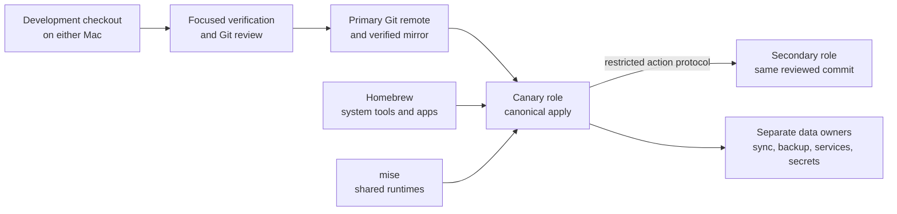

# Workstation showcase

A curated, security-conscious tour of my two-Mac development environment. It
shows how I keep editor, terminal, CLI tooling, mail, calendar, synchronized
data, backups, and machine lifecycle responsibilities understandable without
publishing the production repository or personal service configuration.

## What this demonstrates

- Git-backed configuration with separate development and deployment checkouts.
- Canary-first rollout to two logical machine roles.
- One daily canary command that reconciles source, canary apply, and the
  restricted secondary update, including offline resume.
- Single-pass checks for ordinary changes and reusable, commit-bound evidence
  for bounded critical ones.
- Privilege-free, non-interactive readiness probes for restricted services.
- Clear ownership of packages, runtimes, editor tools, data, and secrets.
- Resumable factory reset and hardware replacement workflows.
- A deterministic private-to-public publication boundary.

## At a glance

| Area | Selected tools | Responsibility |
| --- | --- | --- |
| Configuration | chezmoi, Git | Shared desired state and review history |
| Editor | Neovim, Mason | Editing, LSP, DAP, and editor-only tooling |
| Terminal | WezTerm, tmux, Zsh | Interactive shell and persistent sessions |
| CLI | fzf, ripgrep, fd, jq, yq, lazygit | Navigation, inspection, and automation |
| Runtimes | mise, project lockfiles | Shared runtimes and project reproducibility |
| Mail | mbsync, aerc | Local Maildir synchronization and terminal UI |
| Calendar | CalDAV adapter, Calcurse | Local-first calendar workflow |
| Active data | Syncthing | Current files with peer-side versioning |
| Recovery | Restic | Encrypted historical snapshots and restore tests |
| Secrets | Dedicated manager; optional SOPS/age | Credentials and project-scoped encrypted material |

## Core architecture

The cross-Mac channel is not an interactive shell. It accepts only reviewed,
bounded actions and reports the exact commit plus path-only status. The daily
controller selects the appropriate bounded action from the canary's exact
approval instead of requiring commands to be copied between machines.

## Configuration tour

- [`config/nvim`](config/nvim) — a small, coherent Neovim setup with a reviewed plugin lockfile.
- [`config/wezterm`](config/wezterm) and [`config/tmux`](config/tmux) — terminal and session behavior.
- [`config/shell`](config/shell) — selected Zsh navigation, history, and vi-mode choices.
- [`config/aerc`](config/aerc), [`config/calcurse`](config/calcurse), and [`config/concord`](config/concord) — safe UI and workflow examples.
- [`config/homebrew/Brewfile`](config/homebrew/Brewfile) and [`config/mise/config.toml.tmpl`](config/mise/config.toml.tmpl) — representative package and templated runtime ownership.
- [`docs/tooling.md`](docs/tooling.md) — why each tool belongs to Homebrew, mise, Mason, or the project.
- [`docs/mail-and-calendar.md`](docs/mail-and-calendar.md) — local-first service flow without account details.
- [`docs/synchronization-and-backup.md`](docs/synchronization-and-backup.md) — why synchronization, backup, and secrets remain separate.
- [`docs/machine-lifecycle.md`](docs/machine-lifecycle.md) — reset, replacement, and retirement model.

## How this snapshot stays current

The private workstation repository owns a hand-reviewed `showcase/` tree. A
local, offline exporter checks its exact allowlist, source-review bindings,
file modes, and sensitive-content rules before rendering an empty snapshot.
Updates reach this repository through a feature branch, pull request, and the
required `verify` check. GitHub creates the verified squash commit on protected
`main`. See [`docs/maintenance.md`](docs/maintenance.md).

## Boundary

This is a portfolio and learning artifact, not a one-command installer. It has
an independent Git history and deliberately omits machine inventory, accounts,
addresses, credentials, internal endpoints, device IDs, private keys, backup
destinations, and production service configuration. Copy ideas selectively and
adapt them to your own threat model and environment.
