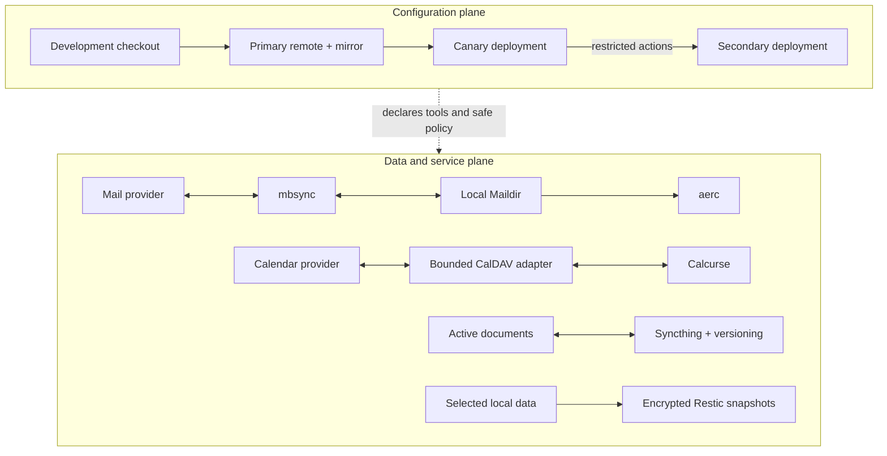

# Architecture

## Source of truth

Shared workstation configuration lives in Git. A primary remote and a mirror
must resolve to the same commit before either Mac applies a change. The
deployment checkout is separate from the development checkout, which keeps
unfinished work away from the live configuration.

The public repository is not part of that deployment path. It receives only a
deterministic, hand-reviewed snapshot with an independent Git history.

## Logical machine roles

| Role | Responsibility |
| --- | --- |
| Canary | Applies and verifies a reviewed commit first; coordinates the secondary |
| Secondary | Applies the identical approved commit after the canary |

Roles are not permanent hardware identities. Replacement hardware can assume a
role only after a candidate bootstrap and reviewed inventory cutover.

The current secondary may use a different architecture from its eventual
replacement. Host-independent CI therefore renders both the active inventory
and a synthetic Apple Silicon secondary before any real machine binding is
changed. Architecture readiness is source evidence, not permission to bypass
the candidate bootstrap or signed inventory cutover.

## Configuration and data planes

Configuration automation never treats synchronized files as backup or Git as
a credential store. Each layer has a separate owner and recovery procedure.

## Tool ownership

| Layer | Owner | Examples |
| --- | --- | --- |
| System CLI, libraries, and GUI applications | Homebrew | Neovim, shellcheck, PostgreSQL client, WezTerm |
| Shared language runtimes | mise | Node, Go, Java, pnpm |
| Editor-only LSP, DAP, and fallback formatters | Mason | Language servers and editor adapters |
| Builds, tests, linting, and formatting | Project | Wrappers, lockfiles, and repository configuration |

This avoids multiple package managers competing to own the same command. See
[`tooling.md`](tooling.md) for the detailed policy.

## Data ownership

| Data | Owner |
| --- | --- |
| Source code and workstation configuration | Git |
| Active documents and notes | File synchronization with versioning |
| Shell history | End-to-end encrypted history synchronization |
| Mail and calendar | Their upstream services |
| Historical machine recovery | Encrypted backups |
| Passwords and recovery material | A dedicated secret manager |

## Restricted cross-Mac control

The canary reaches the secondary through a forced-command protocol with pinned
host trust. It does not provide an interactive shell, file transfer,
forwarding, or arbitrary command execution. Responses are bounded and expose
only the action result, exact commit, role, and path-only drift.

Read-only service readiness checks do not request administrator credentials.
They combine bounded launch/process state with a local protocol handshake;
privileged writes remain isolated in explicit installers. This keeps health
verification usable in unattended automation without weakening the service
boundary or turning a missing terminal prompt into a false outage.
