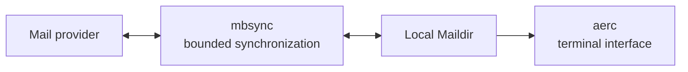
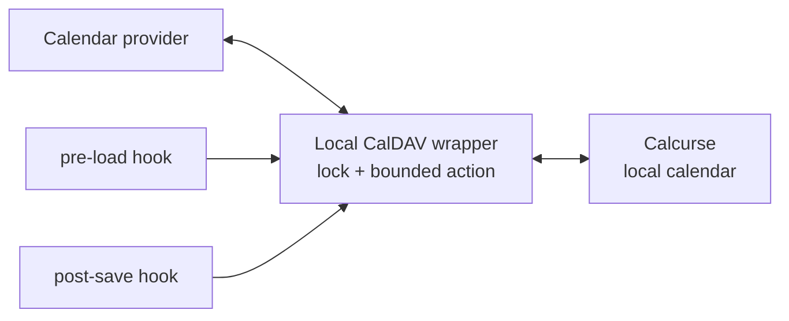

# Mail and calendar

Mail and calendar are local-first interfaces over upstream services. The
workstation repository declares safe behavior and verification, while account
details and credentials remain machine-local.

## Mail flow

- mbsync owns transport between the provider and local Maildir.
- aerc reads and changes the local mail model; it does not own credentials.
- A dry-run and folder mapping verification guard the first real sync after a
  configuration change.
- The published aerc material is limited to portable UI policy such as the
  [`Gruber Darker styleset`](../config/aerc/stylesets/gruber-darker).

Account files, addresses, provider hostnames, OAuth material, mailbox labels,
and mail contents are never public snapshot inputs.

## Calendar flow

The pre-load and post-save hooks both request the same bounded two-way
synchronization. Their names describe when the operation runs, not a one-way
pull or publish direction. The wrapper owns locking, error reporting, and the
exact synchronization command. A network failure does not rewrite
configuration or silently switch to a different calendar.

[`config/calcurse/README.md`](../config/calcurse/README.md) contains safe hook
pseudocode rather than production paths or endpoints.

## Failure boundary

Mail and calendar synchronization never run as a side effect of applying an
unrelated editor, shell, or package change. Their targeted verifiers may inspect
configuration and dry-run behavior. Actual synchronization runs only through a
dedicated command or the reviewed Calcurse pre-load/post-save hooks, never as a
generic configuration-apply side effect.
