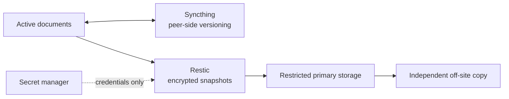

# Synchronization, backup, and secrets

These systems solve different problems and deliberately remain separate.

## Responsibility map

| System | Purpose | Not a replacement for |
| --- | --- | --- |
| Git | Configuration and source history | User-data backup or secret storage |
| Syncthing | Current working files across trusted devices | Historical disaster recovery |
| Restic | Encrypted snapshots and point-in-time restore | Live multi-device synchronization |
| SOPS/age | Optional project-scoped encrypted material | Password-manager recovery or machine identity enrollment |
| Secret manager | Credentials and recovery material | Configuration review history |

## Data flow

The backup client writes encrypted snapshots to a restricted primary target.
The storage side owns independent copying, retention, and integrity checks, so
the workstation does not need credentials for every recovery destination.

## Selection policy

High-churn, reproducible material is excluded from backups. The public
[`excludes.example`](../config/restic/excludes.example) demonstrates the idea
without revealing real home-directory layout. Syncthing similarly selects only
explicit working folders and enables versioning where accidental overwrite is
a realistic risk.

## Recovery is the test

A successful backup command is not sufficient evidence. Restore checks use a
temporary destination, verify representative files, and leave production data
untouched. Machine replacement then restores each data class from its actual
owner rather than copying an old home directory wholesale.
